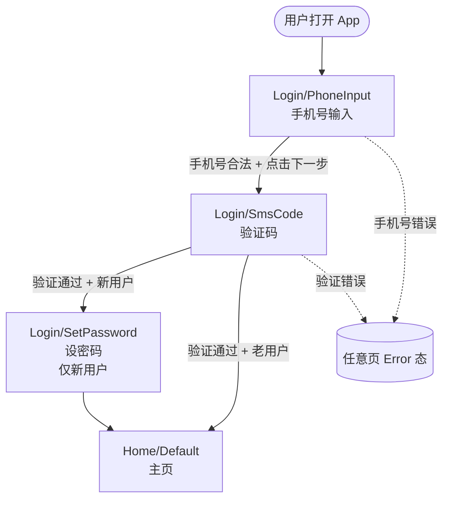

# 流程图两步式输出规范

流程图直接画 Figma 改起来贵。先文本版让用户确认结构，再去 Figma 落地。

---

## 第一步：文本版（在终端给用户看）

### 推荐用 mermaid



### 或者用缩进树（如果用户不熟 mermaid）

```
[Start] 用户打开 App
  ↓
[Page] Login/PhoneInput · 手机号输入
  ├─ action: 输入合法手机号 + 点下一步 → Login/SmsCode
  └─ error: 手机号格式错 → 显示红色提示，不跳转
  ↓
[Page] Login/SmsCode · 验证码
  ├─ action: 输入正确验证码 + 用户已有密码 → Home/Default
  ├─ action: 输入正确验证码 + 新用户 → Login/SetPassword
  ├─ action: 60s 后点重发 → 重发，按钮重置倒计时
  └─ error: 验证码错 → 显示红色提示
  ↓
...
```

### 必须标明

- **入口**: 用户从哪里进入这个流程（推送 / 首页按钮 / deep link / ...）
- **每个 action 后跳哪页**（含条件分支）
- **异常分支**（错误 / 空状态 / 加载超时 / 无权限）
- **终止页**（流程结束在哪 / 是否跳出流程）
- **跨流程跳转**（如登录中点"忘记密码"跳到密码重置流程）
- **侧分支**（modal / sheet 弹出，不跳页但属于流程一部分）

### 必须避开

- ❌ 笼统的"...等"，所有分支必须穷举
- ❌ 只画 happy path，漏掉错误 / 异常
- ❌ 一个节点塞多个页面，每页是独立节点
- ❌ 跳过浮层（modal 也是状态切换）

### 给用户后等什么

🛑 Stop。等用户：
- "结构对了" → 进 Step 6 在 Figma 真画
- "改 X" → 改 mermaid / 树，再给一次
- "加上 Y 流程" → 扩充

文本版可以反复改不心疼。Figma 上改一次就贵了。

---

## 第二步：Figma 流程图落地

### 位置

在 Figma 文件单独建 page：
```
Flow/Login/Diagram
Flow/Onboarding/Diagram
Flow/Payment/Diagram
```

每个流程一个 diagram page。不要把多个流程塞一个 page，后期看不清。

### 节点样式（FigJam 风格）

每个节点 = 一个圆角矩形 + 内部文字：

```
┌─────────────────────────┐
│ Login/PhoneInput        │
│ Default                 │
│ (页面缩略图 thumbnail)   │
└─────────────────────────┘
```

字段：
- 第 1 行：Page 全名（带 layer prefix）
- 第 2 行：State 名
- 第 3 行：（可选）页面缩略图 thumbnail

### 节点颜色编码

- 普通页 → 白底 / 灰边
- 入口页 → 绿底
- 终止页 → 蓝底
- 错误 / 异常态 → 红边
- 浮层（modal / sheet）→ 黄底 + 虚线边

### 箭头

- 主流程 → 实线
- 异常 / 错误分支 → 虚线
- 跨流程跳转 → 粗实线 + 加 "cross flow" label
- 触发条件 → 箭头中点加 label（如 "手机号合法"）

### 布局

- 顺序：左→右（小流程，节点 ≤ 8）/ 上→下（大流程）
- 同一层级的节点 Y 坐标对齐
- 异常分支 Y 偏移 200pt 单独走

### 自动布局代码骨架

```javascript
const diagramPage = figma.root.children.find(p => p.name === 'Flow/Login/Diagram')
                 || (await (async () => {
                      const p = figma.createPage();
                      p.name = 'Flow/Login/Diagram';
                      await figma.setCurrentPageAsync(p);
                      return p;
                    })());

// 节点 = 一个 frame，HORIZONTAL auto-layout，含 label
const makeNode = ({ pageName, state, x, y, role }) => {
  const f = figma.createFrame();
  f.layoutMode = 'VERTICAL';
  f.itemSpacing = 4;
  f.paddingTop = 12; f.paddingBottom = 12;
  f.paddingLeft = 16; f.paddingRight = 16;
  f.cornerRadius = 8;
  f.x = x; f.y = y;
  // role-based fill
  const fillMap = {
    normal: { r: 1, g: 1, b: 1 },
    entry:  { r: 0.85, g: 0.95, b: 0.85 },
    end:    { r: 0.85, g: 0.9, b: 1 },
    error:  { r: 1, g: 0.9, b: 0.9 },
    layer:  { r: 1, g: 0.95, b: 0.7 },
  };
  f.fills = [{ type: 'SOLID', color: fillMap[role] || fillMap.normal }];
  f.strokes = [{ type: 'SOLID', color: { r: 0.6, g: 0.6, b: 0.6 } }];
  f.strokeWeight = 1;
  // 两行文字
  const t1 = figma.createText();
  t1.fontName = { family: 'SF Pro', style: 'Semibold' };
  t1.characters = pageName;
  t1.fontSize = 14;
  f.appendChild(t1);
  const t2 = figma.createText();
  t2.fontName = { family: 'SF Pro', style: 'Regular' };
  t2.characters = state;
  t2.fontSize = 12;
  t2.fills = [{ type: 'SOLID', color: { r: 0.4, g: 0.4, b: 0.4 } }];
  f.appendChild(t2);
  diagramPage.appendChild(f);
  return f;
};

// 箭头 = createVector + 计算坐标
const makeArrow = ({ from, to, label, dashed }) => {
  const v = figma.createVector();
  // 从 from 右边中点到 to 左边中点
  const fx = from.x + from.width;
  const fy = from.y + from.height / 2;
  const tx = to.x;
  const ty = to.y + to.height / 2;
  v.vectorPaths = [{
    windingRule: 'NONZERO',
    data: `M ${fx} ${fy} L ${tx} ${ty}`,
  }];
  v.strokeWeight = 2;
  v.strokes = [{ type: 'SOLID', color: { r: 0.3, g: 0.3, b: 0.3 } }];
  if (dashed) v.dashPattern = [4, 4];
  diagramPage.appendChild(v);
  // label 在中点
  if (label) {
    const t = figma.createText();
    t.fontName = { family: 'SF Pro', style: 'Regular' };
    t.characters = label;
    t.fontSize = 10;
    t.x = (fx + tx) / 2 - t.width / 2;
    t.y = (fy + ty) / 2 - 8;
    diagramPage.appendChild(t);
  }
};
```

⚠️ Font load 别忘了：先 `await figma.loadFontAsync({ family: 'SF Pro', style: 'Regular' })` 和 `Semibold`。

### 自验证

完成后 `get_screenshot` Diagram page → 跟文本版流程图节点数、跳转条数对照，缺一不允交付。

---

## 流程图 vs 页面拼装的关系

- 流程图（Step 6）= 给一份**总览地图**，看流程通路
- 页面拼装（Step 8）= 实际填充每个页面 / 状态的视觉

流程图节点可以加 link / instance 指向真实拼好的 page frame（后期），但**初次画时不要做**，因为页面还没拼。等 Step 8 完成后可以补一轮"diagram 节点连到真页"。
